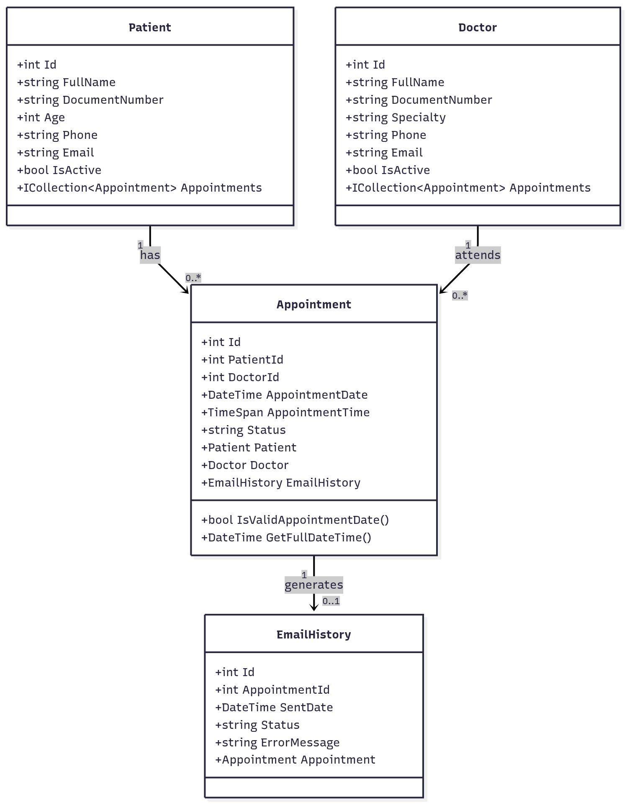

# 🏥 Hospital San Vicente - Medical Appointment Management System

A comprehensive medical appointment management system developed with ASP.NET Core MVC and PostgreSQL, featuring soft delete functionality, email notifications, and real-time conflict validation.

---

## 👨‍💻 Developer Information

**Name:** [Brahiam Ruiz Alzate]  
**Clan:** [Van Rossum]  
**Email:** [brahiamruizalzate@gmail.com]  
**Document ID:** [1001617448]  
**Date:** October 2025  
**Project:** Examen_NET

---

## 📖 Table of Contents

- [Project Description](#-project-description)
- [Key Features](#-key-features)
- [Technologies Used](#-technologies-used)
- [Prerequisites](#-prerequisites)
- [Installation Guide](#-installation-guide)
- [Running the Application](#-running-the-application)
- [Usage Guide](#-usage-guide)
- [Project Structure](#-project-structure)
- [Database Schema](#-database-schema)
- [Business Rules](#-business-rules)
- [Known Issues](#-known-issues)
- [Future Improvements](#-future-improvements)

---

## 📝 Project Description

This system digitizes and optimizes medical appointment management for Hospital San Vicente, replacing manual paper-based records with a robust web application. It centralizes patient, doctor, and appointment information while ensuring data integrity, consistency, and accessibility.

### Problem Solved

The hospital previously managed appointments using physical agendas and spreadsheets, leading to:
- ❌ Duplicate appointments for the same doctor or patient
- ❌ Difficulty finding patient information
- ❌ Lack of control over doctors and their specialties
- ❌ Data loss when agendas were damaged or misplaced

### Solution Provided

✅ Centralized patient, doctor, and appointment management  
✅ Automated appointment scheduling with conflict detection  
✅ Email confirmations with delivery tracking  
✅ Soft delete functionality for data preservation  
✅ Complete audit trail and medical history maintenance

---

## ✨ Key Features

### 1. Patient Management
- ✅ Register patients with personal information
- ✅ Edit patient details
- ✅ Unique document validation
- ✅ View complete appointment history
- ✅ Soft delete (deactivate) instead of physical deletion
- ✅ Reactivate deactivated patients

### 2. Doctor Management
- ✅ Register doctors with specialty information
- ✅ Edit doctor details
- ✅ Unique document validation
- ✅ Filter by medical specialty
- ✅ View doctor's appointment schedule
- ✅ Soft delete (deactivate) with appointment validation
- ✅ Reactivate deactivated doctors

### 3. Appointment Management
- ✅ Schedule appointments with date and time
- ✅ **30-minute conflict validation** (prevents overlapping appointments)
- ✅ Real-time availability checking
- ✅ Status management (Scheduled/Completed/Cancelled)
- ✅ **Automatic email notifications** with MailKit
- ✅ Email delivery tracking
- ✅ Filter appointments by patient or doctor
- ✅ Time picker with AM/PM format (Flatpickr)
- ✅ **No physical deletion** - appointments are cancelled, not deleted

### 4. Email System
- ✅ Automatic email confirmation on appointment creation
- ✅ HTML-formatted professional emails
- ✅ Email history tracking (Sent/Failed status)
- ✅ Error logging for failed deliveries
- ✅ Configurable SMTP settings

### 5. Data Protection
- ✅ **Soft delete for patients and doctors** (regulatory compliance)
- ✅ **Logical deletion for appointments** (via status change)
- ✅ Complete audit trail preservation
- ✅ Protection against deletion of entities with active appointments

---

## 🛠️ Technologies Used

| Technology | Version | Purpose |
|-----------|---------|---------|
| .NET | 8.0 | Backend framework |
| ASP.NET Core MVC | 8.0 | Web application pattern |
| Entity Framework Core | 8.0 | ORM for database access |
| PostgreSQL | 14+ | Relational database |
| Npgsql | Latest | PostgreSQL provider for .NET |
| MailKit | Latest | Email sending library |
| Bootstrap | 5.3 | Responsive UI framework |
| Bootstrap Icons | 1.11 | Icon library |
| Flatpickr | Latest | Time picker with AM/PM |
| C# | 12 | Programming language |
| HTML5 / CSS3 | - | Frontend markup |
| JavaScript | ES6 | Client-side scripting |

---

## 📋 Prerequisites

Before running this application, ensure you have the following installed:

### Required Software

1. **.NET 8.0 SDK or later**
    - Download: https://dotnet.microsoft.com/download
    - Verify installation: `dotnet --version`

2. **PostgreSQL 14 or later**
    - Download: https://www.postgresql.org/download/
    - Or use existing remote database

3. **Git** (optional, for cloning)
    - Download: https://git-scm.com/downloads

4. **Code Editor** (choose one):
    - Visual Studio 2022 (Community or higher)
    - Visual Studio Code with C# extension
    - JetBrains Rider

### Email Configuration (Optional)

For real email sending, you'll need:
- Gmail account with 2FA enabled + App Password, OR
- Mailtrap account (recommended for testing): https://mailtrap.io

---

## 📥 Installation Guide

### Step 1: Clone or Download the Project
```bash
# Option A: Clone with Git
git clone https://github.com/yourusername/Examen_NET.git
cd Examen_NET

# Option B: Download ZIP and extract
# Then navigate to the project folder
cd Examen_NET
```

### Step 2: Configure Database Connection

Open `appsettings.json` and verify/update the connection string:
```json
{
  "ConnectionStrings": {
    "DefaultConnection": "Host=91.98.42.248;Port=5432;Database=skytravel_db;Username=postgres;Password=password-voyager"
  }
}
```

**Note:** The project is already configured with a remote PostgreSQL database. If you want to use your own database, update the connection string accordingly.

### Step 3: Configure Email Settings (Optional)

In `appsettings.json`, configure email settings:

#### For Mailtrap (Recommended for Testing):
```json
{
  "EmailSettings": {
    "SmtpServer": "sandbox.smtp.mailtrap.io",
    "Port": 2525,
    "SenderName": "Hospital San Vicente",
    "SenderEmail": "noreply@hospital.com",
    "Password": "YOUR_MAILTRAP_PASSWORD"
  }
}
```

#### For Gmail (Production):
```json
{
  "EmailSettings": {
    "SmtpServer": "smtp.gmail.com",
    "Port": 587,
    "SenderName": "Hospital San Vicente",
    "SenderEmail": "your-email@gmail.com",
    "Password": "YOUR_APP_PASSWORD"
  }
}
```

**Gmail Setup:**
1. Enable 2-Step Verification: https://myaccount.google.com/security
2. Create App Password: https://myaccount.google.com/apppasswords
3. Use the 16-character password (no spaces)

### Step 4: Restore NuGet Packages
```bash
dotnet restore
```

### Step 5: Apply Database Migrations

The database is already migrated, but if you need to recreate:
```bash
# View existing migrations
dotnet ef migrations list

# Apply migrations
dotnet ef database update
```

### Step 6: Build the Project
```bash
dotnet build
```

If successful, you should see:
```
Build succeeded.
    0 Warning(s)
    0 Error(s)
```

---

## 🚀 Running the Application

### Development Mode
```bash
dotnet run
```

The application will start and display:
```
info: Microsoft.Hosting.Lifetime[14]
      Now listening on: https://localhost:5001
      Now listening on: http://localhost:5000
```

### Access the Application

Open your browser and navigate to:
- **HTTPS:** https://localhost:5001
- **HTTP:** http://localhost:5000

### Default Landing Page

You'll see the Hospital San Vicente dashboard with three main sections:
- 👥 **Patients** - Manage patient records
- 👨‍⚕️ **Doctors** - Manage doctor information
- 📅 **Appointments** - Schedule and manage appointments

---

## 📘 Usage Guide

### 1. Managing Patients

#### Create a New Patient
1. Click **"Patients"** in the navigation menu
2. Click **"Nuevo Paciente"** (New Patient)
3. Fill in the form:
    - Full Name (required)
    - Document Number (required, must be unique)
    - Age (required, 1-120)
    - Phone (required)
    - Email (required, valid format)
4. Click **"Guardar"** (Save)

#### Edit a Patient
1. Go to Patients list
2. Click the **pencil icon** (Edit)
3. Modify the information
4. Click **"Actualizar"** (Update)

#### View Patient Details
1. Click the **eye icon** (Details)
2. View patient information and appointment history

#### Deactivate a Patient
1. Click the **X icon** (Deactivate)
2. Confirm the action
3. **Note:** Cannot deactivate if patient has scheduled appointments

#### Reactivate a Patient
1. Click **"Ver Inactivos"** (View Inactive)
2. Find the inactive patient
3. Click the **circular arrow icon** (Reactivate)

### 2. Managing Doctors

#### Create a New Doctor
1. Click **"Médicos"** (Doctors) in navigation
2. Click **"Nuevo Médico"** (New Doctor)
3. Fill in the form:
    - Full Name (required)
    - Document Number (required, must be unique)
    - Specialty (required, suggestions provided)
    - Phone (required)
    - Email (required)
4. Click **"Guardar"** (Save)

#### Filter by Specialty
1. In the Doctors list
2. Use the **"Filtrar por Especialidad"** dropdown
3. Select a specialty (automatically filters)
4. Click **"Limpiar"** (Clear) to remove filter

#### Deactivate/Reactivate Doctors
Same process as patients (see above)

### 3. Scheduling Appointments

#### Create an Appointment
1. Click **"Citas"** (Appointments) in navigation
2. Click **"Nueva Cita"** (New Appointment)
3. Select a patient from dropdown
4. Select a doctor from dropdown
5. Choose appointment date (calendar picker)
6. Choose appointment time (click to open time picker with AM/PM)
7. Click **"Agendar Cita"** (Schedule Appointment)

**Automatic Actions:**
- ✅ System validates for scheduling conflicts (30-minute buffer)
- ✅ Email confirmation sent to patient automatically
- ✅ Email delivery status recorded

#### View Appointment Details
1. Go to Appointments list
2. Click the **eye icon** (Details)
3. View:
    - Appointment information
    - Email delivery status
    - Available actions (if scheduled)

#### Change Appointment Status

**For Scheduled Appointments:**
- **Mark as Completed:** Click **"Marcar como Atendida"**
- **Cancel Appointment:** Click **"Cancelar Cita"**

**Important:** Appointments are never physically deleted, only status-changed for audit trail preservation.

#### Edit an Appointment
1. Only available for **"Scheduled"** appointments
2. Click the **pencil icon** (Edit)
3. Modify date, time, doctor, or patient
4. System re-validates conflicts
5. Click **"Actualizar Cita"** (Update)

#### Filter Appointments
Use the filter form at the top:
- **By Patient:** Select from dropdown
- **By Doctor:** Select from dropdown
- Click **"Filtrar"** (Filter)
- Click **"Limpiar"** (Clear) to remove filters

### 4. Email Notifications

#### Viewing Email History
1. Go to appointment Details
2. Check the **"Historial de Correo"** section
3. View:
    - ✅ Status: Sent/Failed
    - 📅 Sent Date
    - 📧 Recipient Email
    - ❌ Error Message (if failed)

#### Troubleshooting Email Failures
Check `appsettings.json` email configuration if emails fail to send.

---

## 📁 Project Structure
```
Examen_NET/
│
├── Controllers/                    # MVC Controllers
│   ├── HomeController.cs           # Dashboard
│   ├── PatientController.cs        # Patient CRUD + Soft Delete
│   ├── DoctorController.cs         # Doctor CRUD + Soft Delete
│   └── AppointmentController.cs    # Appointment management
│
├── Models/                         # Data Models
│   ├── Patient.cs                  # Patient entity with IsActive
│   ├── Doctor.cs                   # Doctor entity with IsActive
│   ├── Appointment.cs              # Appointment with status
│   ├── EmailHistory.cs             # Email tracking
│   └── EmailSettings.cs            # Email configuration model
│
├── Views/                          # Razor Views
│   ├── Home/
│   │   └── Index.cshtml            # Dashboard
│   ├── Patient/
│   │   ├── Index.cshtml            # List with active/inactive toggle
│   │   ├── Create.cshtml
│   │   ├── Edit.cshtml
│   │   ├── Details.cshtml
│   │   └── Deactivate.cshtml       # Soft delete confirmation
│   ├── Doctor/
│   │   ├── Index.cshtml            # List with specialty filter
│   │   ├── Create.cshtml
│   │   ├── Edit.cshtml
│   │   ├── Details.cshtml
│   │   └── Deactivate.cshtml
│   ├── Appointment/
│   │   ├── Index.cshtml            # List with patient/doctor filters
│   │   ├── Create.cshtml           # With Flatpickr time picker
│   │   ├── Edit.cshtml
│   │   └── Details.cshtml          # With status actions
│   └── Shared/
│       └── _Layout.cshtml          # Main layout with navigation
│
├── Data/
│   └── AppDbContext.cs             # EF Core DbContext
│
├── Services/
│   └── EmailService.cs             # Email sending service
│
├── Migrations/                     # EF Core migrations
│   └── [timestamp]_*.cs
│
├── wwwroot/                        # Static files
│   ├── css/
│   ├── js/
│   └── lib/
│
├── Program.cs                      # Application entry point
├── appsettings.json               # Configuration
└── Examen_NET.csproj              # Project file
```

---

## 🗄️ Database Schema

### Tables

#### **Patients**
```sql
- Id (PK, SERIAL)
- FullName (VARCHAR(100), NOT NULL)
- DocumentNumber (VARCHAR(20), UNIQUE, NOT NULL)
- Age (INTEGER, NOT NULL)
- Phone (VARCHAR(20), NOT NULL)
- Email (VARCHAR(100), NOT NULL)
- IsActive (BOOLEAN, DEFAULT TRUE) ⭐
```

#### **Doctors**
```sql
- Id (PK, SERIAL)
- FullName (VARCHAR(100), NOT NULL)
- DocumentNumber (VARCHAR(20), UNIQUE, NOT NULL)
- Specialty (VARCHAR(100), NOT NULL)
- Phone (VARCHAR(20), NOT NULL)
- Email (VARCHAR(100), NOT NULL)
- IsActive (BOOLEAN, DEFAULT TRUE) ⭐
```

#### **Appointments**
```sql
- Id (PK, SERIAL)
- PatientId (FK → Patients.Id)
- DoctorId (FK → Doctors.Id)
- AppointmentDate (TIMESTAMP, NOT NULL)
- AppointmentTime (TIME, NOT NULL)
- Status (VARCHAR(20), DEFAULT 'Scheduled')
  -- Values: Scheduled, Completed, Cancelled
```

#### **EmailHistories**
```sql
- Id (PK, SERIAL)
- AppointmentId (FK → Appointments.Id, UNIQUE)
- SentDate (TIMESTAMP, DEFAULT CURRENT_TIMESTAMP)
- Status (VARCHAR(20), DEFAULT 'Sent')
  -- Values: Sent, Failed
- ErrorMessage (VARCHAR(500), NULLABLE)
```

### Relationships
```
Patient (1) ──< (N) Appointments
Doctor (1) ──< (N) Appointments
Appointment (1) ─── (1) EmailHistory
```

### Indexes

- `IX_Patients_DocumentNumber` (UNIQUE)
- `IX_Doctors_DocumentNumber` (UNIQUE)
- `IX_Appointments_DoctorDateTime` (DoctorId, AppointmentDate, AppointmentTime)
- `IX_Appointments_PatientDateTime` (PatientId, AppointmentDate, AppointmentTime)

---

## ⚖️ Business Rules

### 1. Document Uniqueness
- ✅ Patient document numbers must be unique
- ✅ Doctor document numbers must be unique
- ✅ Validation occurs before creation and update

### 2. Appointment Conflict Prevention
- ✅ **30-minute buffer validation**
- ✅ A doctor cannot have appointments within 30 minutes of each other
- ✅ A patient cannot have appointments within 30 minutes of each other
- ✅ Validation applies to both creation and editing

**Example:**
```
Existing appointment: 10:00 AM
Blocked times: 9:30 AM - 10:30 AM
Allowed: 10:31 AM onwards
```

### 3. Soft Delete (Data Preservation)
- ✅ **Patients:** Marked as `IsActive = false` (never physically deleted)
- ✅ **Doctors:** Marked as `IsActive = false` (never physically deleted)
- ✅ **Appointments:** Status changed to "Cancelled" (never physically deleted)
- ✅ Prevents deletion of entities with active appointments
- ✅ Maintains complete audit trail for regulatory compliance

### 4. Status Management
**Appointment States:**
```
Scheduled → Completed  ✅ (appointment was attended)
Scheduled → Cancelled  ✅ (appointment was cancelled)
Completed → [Final]    ❌ (cannot change)
Cancelled → [Final]    ❌ (cannot change)
```

### 5. Active Entity Validation
- ✅ Cannot schedule appointments with inactive doctors
- ✅ Cannot schedule appointments with inactive patients
- ✅ Validation occurs during creation and editing

### 6. Email Notifications
- ✅ Automatic email sent on appointment creation
- ✅ Email history recorded (Sent/Failed)
- ✅ Error messages logged for debugging

---

## 🐛 Known Issues

### 1. Time Zone Handling
- **Issue:** All times stored in UTC in PostgreSQL
- **Solution:** `.ToLocalTime()` used in views to display local time
- **Impact:** None, handled correctly

### 2. Email Simulation Mode
- **Issue:** Default configuration may use simulated emails
- **Solution:** Configure real SMTP in `appsettings.json`
- **Impact:** Emails logged to console but not actually sent unless configured

### 3. Shared Database
- **Note:** Project uses a shared database with another application (SkyTravel)
- **Impact:** None, tables have different names (English vs Spanish)
- **Recommendation:** Use dedicated database in production

---

## 🔮 Future Improvements

### Potential Enhancements

1. **Authentication & Authorization**
    - User roles (Admin, Doctor, Receptionist)
    - Login system with JWT tokens

2. **Advanced Reporting**
    - Appointment statistics dashboard
    - No-show tracking
    - Doctor performance metrics

3. **Patient Portal**
    - Self-service appointment booking
    - View medical history
    - Update personal information

4. **SMS Notifications**
    - Appointment reminders via SMS
    - Confirmation codes

5. **Calendar View**
    - Visual weekly/monthly appointment calendar
    - Drag-and-drop rescheduling

6. **Medical Records**
    - Attach visit notes to appointments
    - Upload lab results
    - Prescription management

7. **Internationalization**
    - Multi-language support
    - Spanish/English toggle

8. **API Development**
    - RESTful API for mobile apps
    - Integration with external systems

---
## 🖼️ Screenshots

### 🧩 Use Case Diagram 1


### 🧩 Use Case Diagram 2


### 🧩 UML Class Diagram



## 📞 Support

For questions, issues, or contributions:

**Developer:** [Your Name]  
**Email:** [your.email@example.com]  
**Project Repository:** [GitHub URL]

---

## 📄 License

This project was developed as an academic exercise for [Institution Name].  
All rights reserved © 2025

---

## 🙏 Acknowledgments

- ASP.NET Core MVC Documentation
- Entity Framework Core Team
- Bootstrap Framework
- Flatpickr Library
- MailKit Contributors
- Stack Overflow Community

---

**Last Updated:** October 14, 2025  
**Version:** 1.0.0  
**Status:** ✅ Production Ready

---

## 🎓 Academic Notes

**Institution:** [Your Institution]  
**Course:** [Course Name]  
**Instructor:** [Instructor Name]  
**Submission Date:** [Date]

### Assessment Criteria Met

✅ Complete CRUD operations for all entities  
✅ Database persistence with EF Core  
✅ Business rule validations  
✅ Error handling with try-catch blocks  
✅ Email notification system  
✅ Soft delete implementation  
✅ Professional UI with Bootstrap  
✅ Clean code architecture  
✅ Comprehensive documentation

---

**End of README**